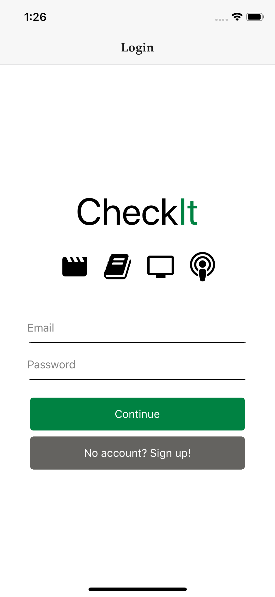

CheckIt is a mobile app that allows you to send and receive recommendations for content such as books, movies, podcasts, and more. You can keep track of who recommended what and when, manage your lists, and get real-time notifications for new recommendation. The app is built using React Native, Redux, socket.io, Node, Express, Sequelize, and PostgresQL.

For server code, see https://github.com/johnnyslots/checkit-server

Login / Signup flow:

Send recommendations or requests for recommendations to friends:

Recive a recommendation from a friend and decide whether to accept it into your list:

Add items to your own list:

See your pending recommendations:

See your open requests for recommendations:

Search for CheckIt users to add as friends, and see pending friend requests:

